# Milestone Project 1
This is a photographer's website. It is designed to be responsive and accessible on different devices. 
My client and I had discussed thoroughly the look  and the purpose of the website, so I designed it with the thought of having a simple and eye-catching webpage. The aim of the project is to show his works and find clients.

## Design
- Colour Scheme: The main colours used are black, white and grey. My client takes black&white pictures so I decided to follow his style.
- Typography: The main font used is Arial for the whole website with Helvetica and san-serif as fallback font in case the main fonts is not imported into the site correctly.
- Imagery: Together with my client we chose a picture for the background's home page. We find it attractive in his semplicity.
## User Experience (UX)

### User Stories
- First Time Visitor Goals
    1. As a First Time Visitor, I want to understand the main purpose of the website.
    2. As a First Time Visitor, I want to be able to navigate the site easily.
- Returning Visitor Goals
    1. As a Returning Visitor, I want to find information about the Photographer and see his works.
    2. As a returning Visitor, I want to find the best way to get in contact with the Photographer. 
- Frequent User Goals
    1. As a Frequent User, I want to find easily the Gallery Page to see if there are any new works.
    2. As a Frequent User, I want to find community links to follow his work-life. 

### Wireframes
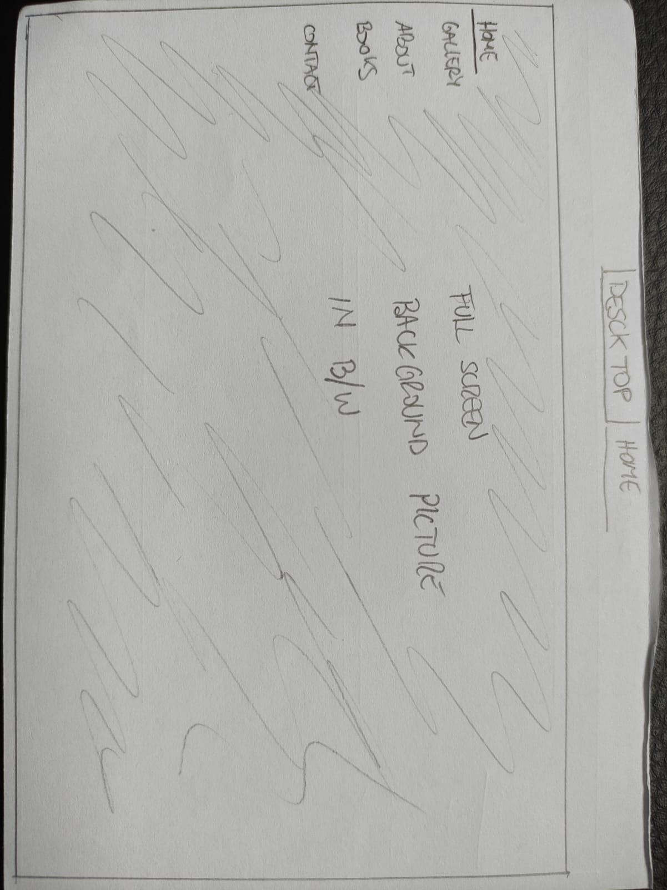
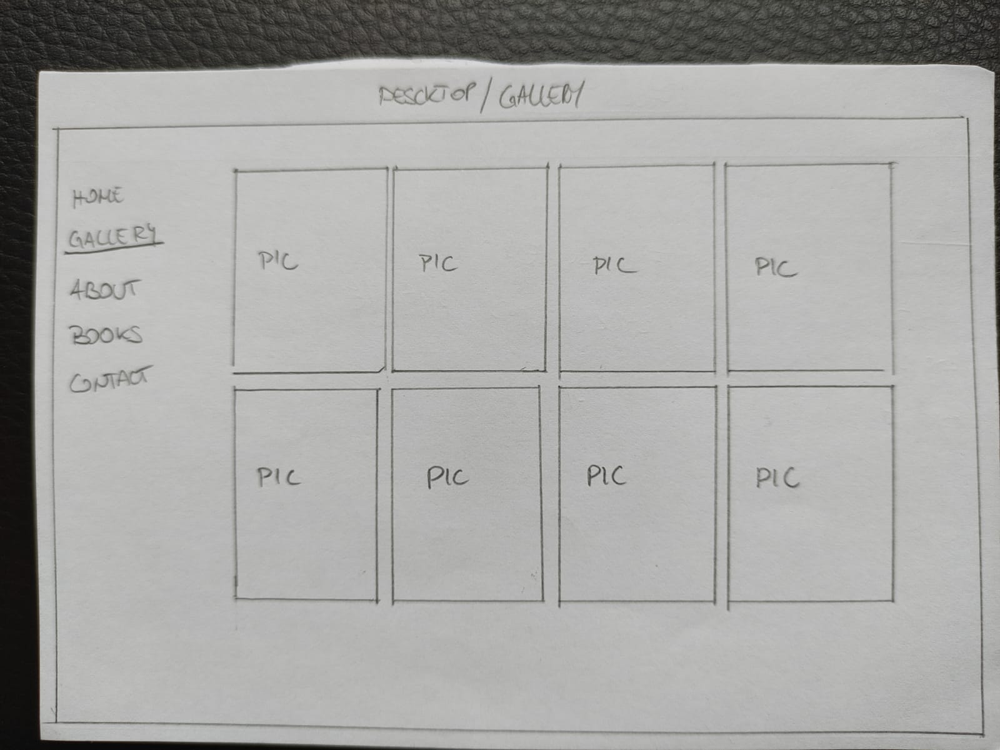
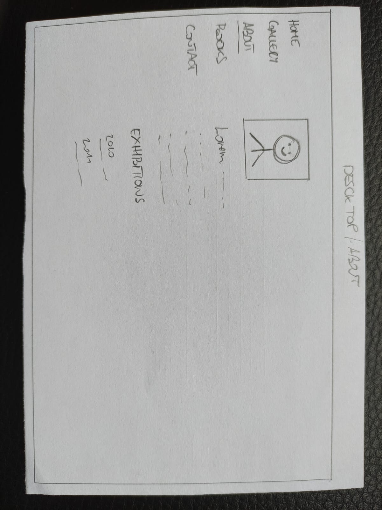

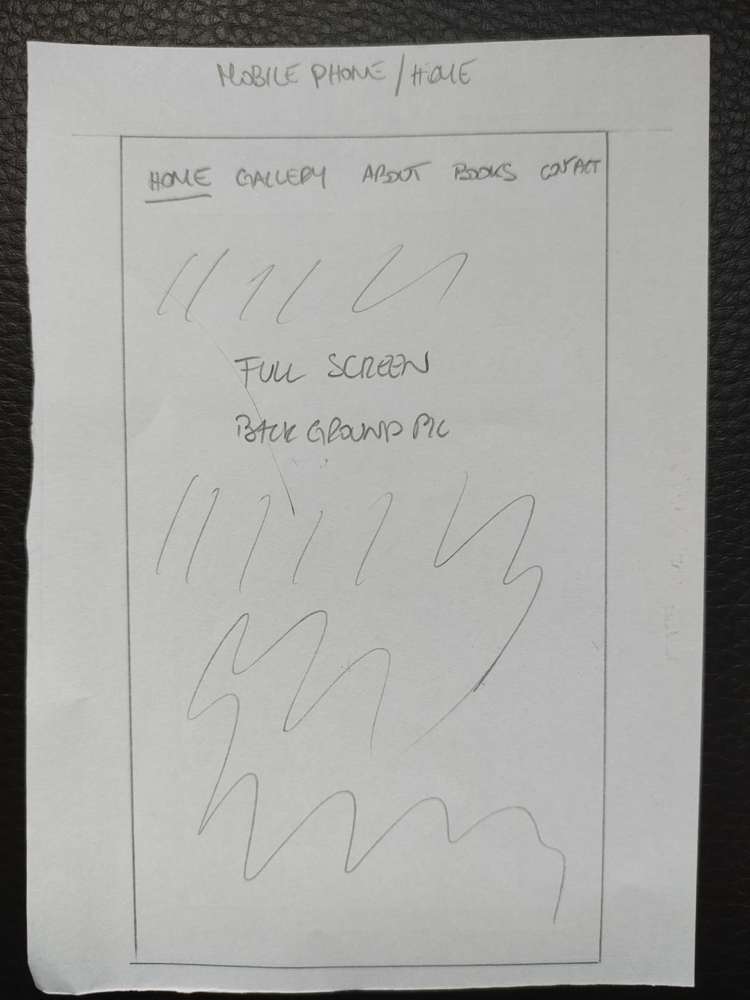
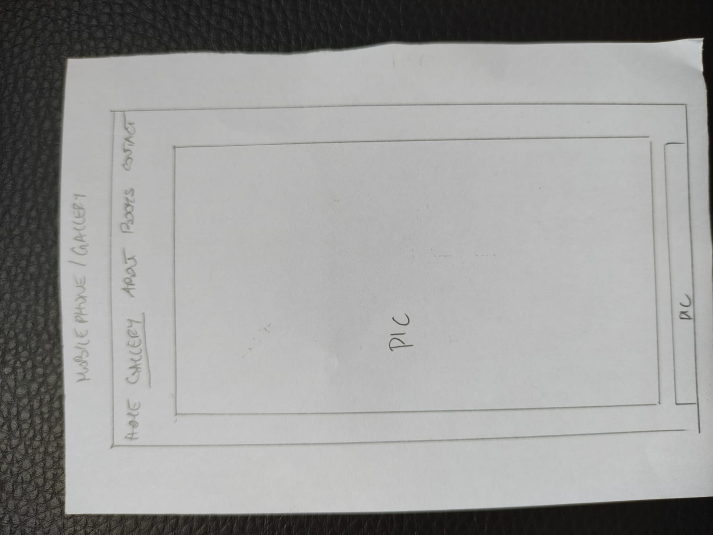

## Feature
- Responsive to three device sizes as per the project's requirement.
- Interactive elements.
- The Books page is a direct link to the blurb website.

### - Navigation bar and Home page
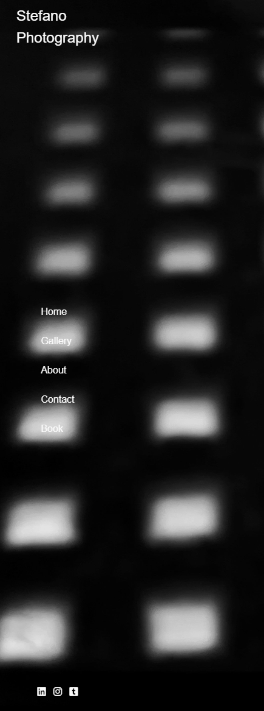

- Featured on all the pages, the navigation bar includes links to Home, Gallery, About, and Contact pages. It also includes icons for Linkedin, Instagram, and Tumblr. It is identical on each page for easy navigation.
- This section will allow the user to navigate easily through the website from one page to another.
- The Home Page introduces the user to Stefano Photography with an interesting full-screen background photograph.

### - Gallery
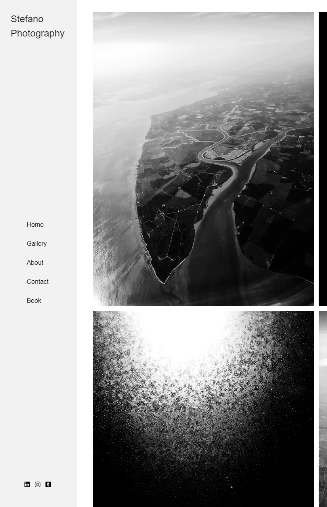

- The Gallery is showing some of the Photographer's works. This section will expand every time new pictures are  uploaded.
- The user will see what kind of works the Photographer does.

### - About
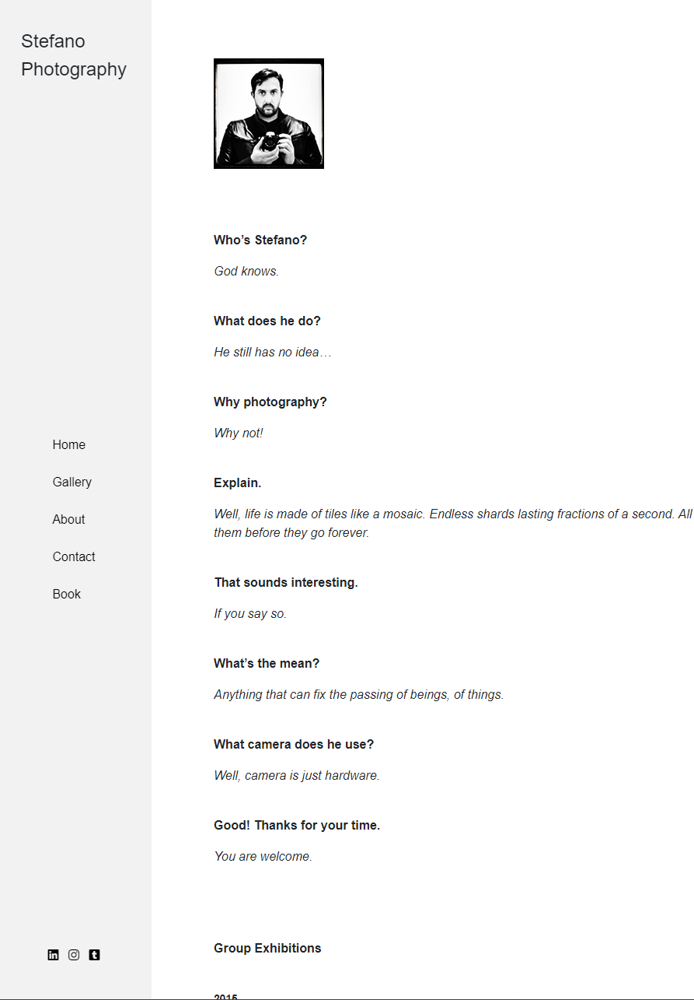

- The About page is for the user to know the Photographer.It consists in a small interview to the Photographer and also his exhibitions.

### - Contact
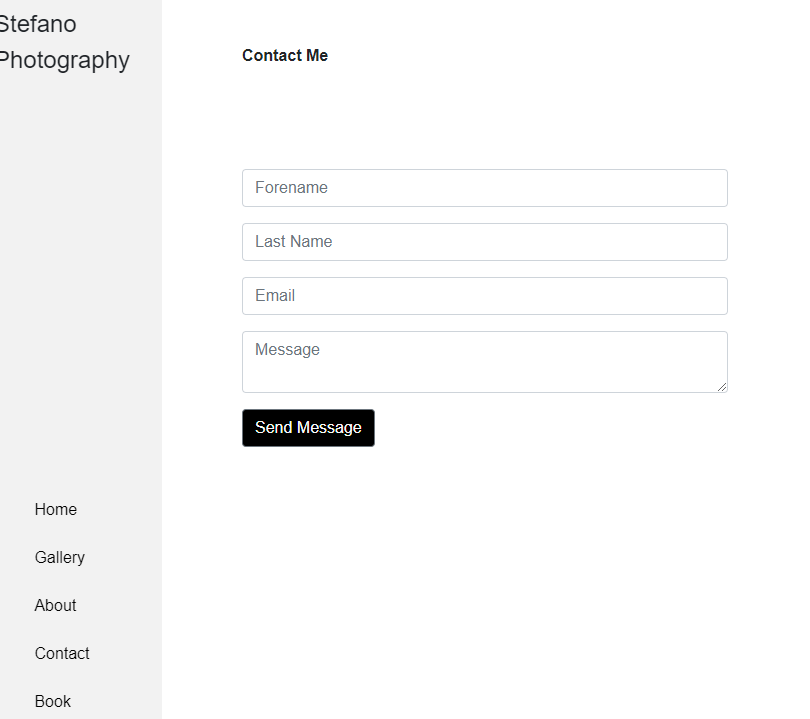

- The Contact page is for the user to get in touch with the Photographer if they want to work together or hire him.

## Technologies Used
### Languages Used
- HTML5
- HTML5
- CSS3
### Frameworks, Libraries & Programs Used
1. Bootstrap 4.4.1:
- Bootstrap was used for the Form.
2. Font Awesome:
- Font Awesome was used on all pages to add icons for aesthetic and UX purposes.
3. Git:
- Git was used for version control by utilizing the Gitpod terminal to commit to Git and Push to GitHub.
4. GitHub:
- GitHub is used to store the project's code after being pushed from Git.
## Testing
The W3C Markup Validator and W3C CSS Validator Services were used to validate every page of the project to ensure there were no syntax errors in the project.
- W3C Markup Validator - No errors

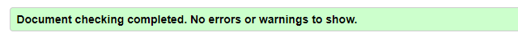

- W3C CSS Validator - No errors

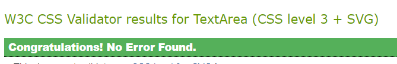

The https://responsivedesignchecker.com/ website was used to check the responsiveness of the website, that seems to respond nicely in varius devices.

## Testing User Stories from UX section
### - First time visitor Goals
    1. As a First Time Visitor, I want to understand the main purpose of the website.
    2. As a First Time Visitor, I want to be able to navigate the site easily.
- The main point is made immediately with the Title.
When entering the site, users are automatically greeted with a clean and easily readable navigation bar to go to the page of their choice.

### - Returning Visitor Goals
    1. As a Returning Visitor, I want to find information about the Photographer and see his works.
    2. As a returning Visitor, I want to find the best way to get in contact with the Photographer.
- By clicking on the Gallery page the returning visitor can see the photographer's works. 
On the navigation bar the returning visitor can find the "Contact" Page. Here they can fill out the form or alternately they can use the social media icons on the navigation bar.

### - Frequent User Goals
    1. As a Frequent User, I want to find easily the Gallery Page to see if there are any new works.
    2. As a Frequent User, I want to find community links to follow his work-life.
- As mention already, the navigation bar clealy states the Gallery page and the social media icons.

## Further Testing
- Friends and family members were asked to review the site and documentation to point out any bugs and user experience issues.

## Known Bugs
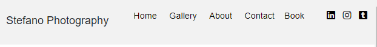
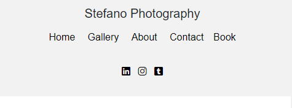

On the Tablet screen, the Brand-title is not aligned with the navbar.
On the Phone screen, the header is not centered.

I have used display property flex for the header. I've been looking for a solution several times but couldn't find it. 

On the gallery.html I have change the section element with a div as suggested from W3C Marckup Validator.

## Deployment
I used GitHub to deploy this website. The steps to deploy it are the following:
1. GitHub Repository
2. Setting
3. GitHub Pages
4. Under "Source" click the dropdown called "None" and chose "main branch".
5. The page will refresh on its own
6. Scroll down through the page to locate the now-publish site link in the "GitHub Pages" section.

The live link can be found here ABCDEFGHI
## Credits
- Bootstrap4: Bootstrap library was used on the form.
## Content
- All content was written by the developer with client supervision.
## Media
- All Images were obtained from my client.
## Acknowledgements
- My Mentor Jubril for his feedback.
- Tutor support at Code Institute for their help.
- The client for providing the picture.

