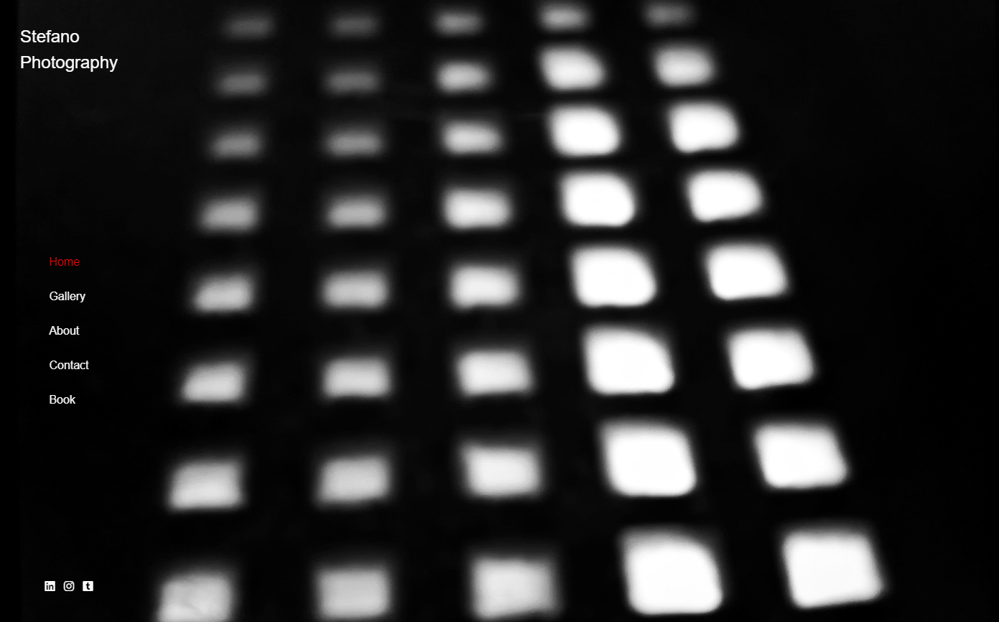
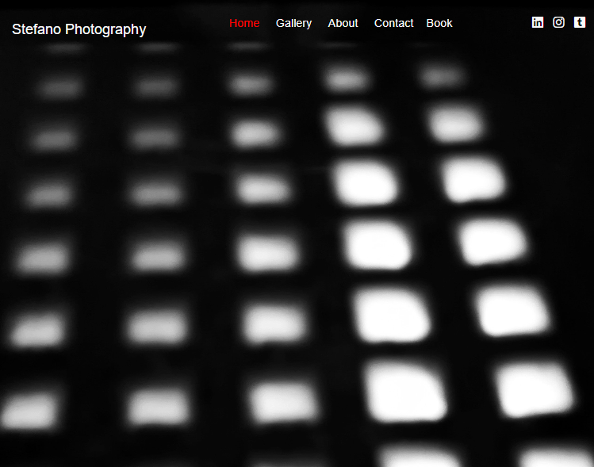
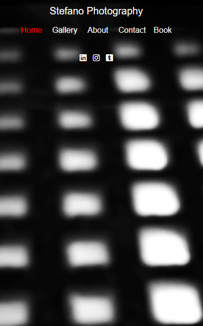

# Milestone Project 1
This is a photographer's website. It is designed to be responsive and accessible on different devices. 
My client and I had discussed thoroughly the look  and the purpose of the website, so I designed it with the thought of having a simple and eye-catching webpage. The aim of the project is to show his works and find clients.

## Design
- Colour Scheme: The main colours used are black, white and grey. My client takes black&white pictures so I decided to follow his style.
- Typography: The main font used is Arial for the whole website with Helvetica and san-serif as fallback font in case the main fonts is not imported into the site correctly.
- Imagery: Together with my client we chose a picture for the background's home page. We find it attractive in his semplicity.
## User Experience (UX)

### User Stories
- First Time Visitor Goals
    1. As a First Time Visitor, I want to understand the main purpose of the website.
    2. As a First Time Visitor, I want to be able to navigate the site easily.
- Returning Visitor Goals
    1. As a Returning Visitor, I want to find information about the Photographer and see his works.
    2. As a returning Visitor, I want to find the best way to get in contact with the Photographer. 
- Frequent User Goals
    1. As a Frequent User, I want to find easily the Gallery Page to see if there are any new works.
    2. As a Frequent User, I want to find community links to follow his work-life. 

